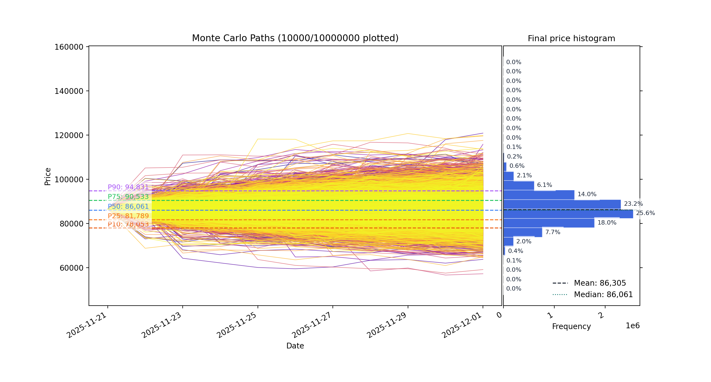
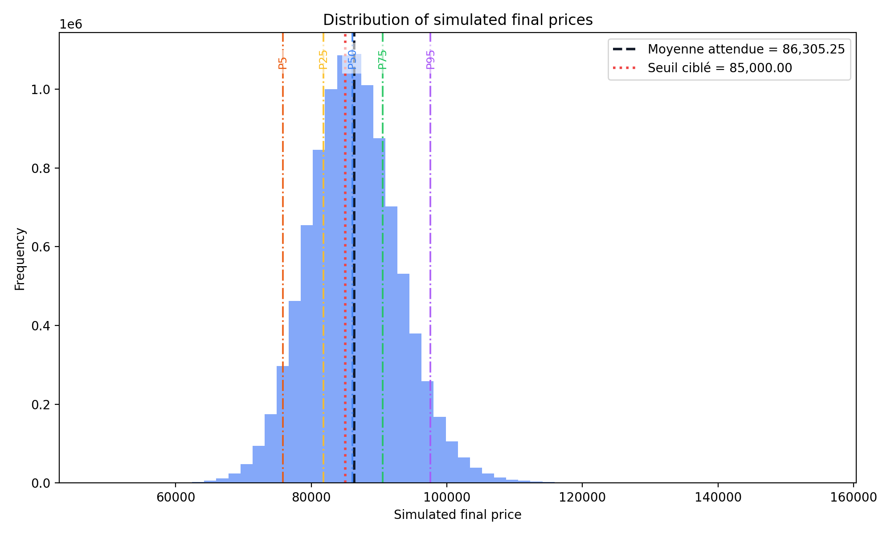

# Heston Monte-Carlo — Simulateur de volatilité stochastique crypto

🇫🇷 **Français** · [🇬🇧 English](README.en.md)

Projet de finance quantitative : un **modèle de Heston à volatilité stochastique
avec sauts** appliqué aux marchés crypto, plus un laboratoire d'apprentissage qui
construit la théorie depuis zéro.

## 🎯 `Heston.v2/` — simulateur Heston Bitcoin (pièce maîtresse)

Un package Python propre, modulaire et testé (`heston_crypto_sim`) qui :

- récupère les données de marché via l'API publique **Binance** (`data_fetcher`)
- détecte le **régime de marché** courant (`regimes`)
- estime les paramètres **Heston + sauts** heuristiquement (`params_estimator`)
- lance une simulation **Monte-Carlo** des trajectoires de prix (`models/heston_jump`)
- calcule des probabilités pour des paris type **Polymarket** — hausse/baisse,
  « au-dessus de K », « dans [K1, K2] » (`stats_tools`, `polymarket_adapter`)
- génère des graphes et un **rapport HTML** autonome (`reporting/`)

```bash
cd Heston.v2
python -m heston_crypto_sim.cli      # lance une simulation + rapport HTML
pytest tests_sanity.py               # tests de cohérence
```

### Exemple de sortie

Trajectoires de prix BTC simulées et distribution du prix terminal :





## 📚 `heston-learning-lab/` — théorie pas à pas (FR)

Laboratoire Jupyter dockerisé (5 notebooks, en français) qui construit le modèle
depuis les bases : mouvement brownien → modèle de Heston complet → Monte-Carlo →
génération de rapports HTML.

```bash
cd heston-learning-lab && ./start_lab.sh   # Jupyter via Docker
```

## `kyle/` — Monte-Carlo GBM
Simulations de portefeuille par mouvement brownien géométrique (scripts d'échauffement).

---
*Projet éducatif / de recherche — pas un conseil financier.*
